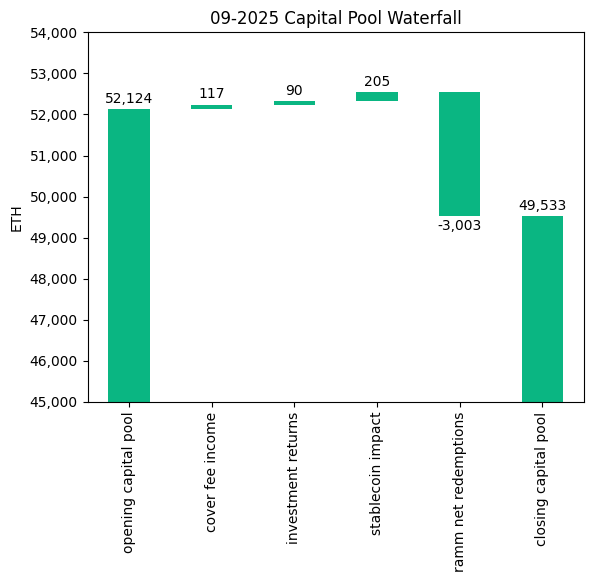
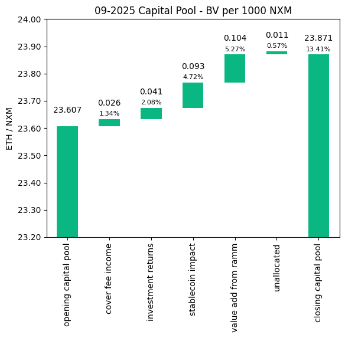
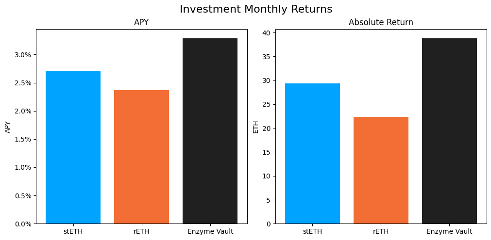

# Investment Committee Newsletter - September 2025

The Investment Committee team presents its September 2025 newsletter, where we share insights surrounding the Capital Pool and Nexus Mutual's investments. The goal is to make key data transparent and easily accessible to everyone.

## State of the Capital Pool

### Monthly Change - ETH value

The Capital Pool decreased by 4.97% in ETH terms this month, from 52.1k to 49.5k ETH. Withdrawals through the RAMM, which totaled 3.0k redemptions, were the primary factor in this decline. However, the slight drop in ETH price created a positive FX impact from stablecoin holdings, while both Cover Fees and Investment holdings also contributed positively.

The various impacts on the capital pool are summarised in the waterfall chart below.



The cover fee income is net of distribution commissions and excludes covers paid for in NXM. In such a case, the cover fee gets burned and there is no change in the Capital Pool.

### Monthly Change in NXM Book Value

The Capital Pool's ETH/NXM value rose from 0.02360 to 0.02387, representing a 13.41% annualized increase for the month. This growth primarily resulted from two factors: the significant positive FX impact from stablecoin holdings and substantial value added through the RAMM.

The various impacts on the capital pool are summarised in the waterfall chart below.


→ Members can track protocol's revenue on the [Financials Dune Dashboard](https://dune.com/nexus_mutual/capital-pool-and-ownership)
→ Members can track in/outflows on the [Ratcheting AMM Dune Dashboard](https://dune.com/nexus_mutual/ramm)
→ Members can track the cover income on the [Covers Dune Dashboard](https://dune.com/nexus_mutual/covers)

### End of Month Pool Split

The split of the Capital Pool at the end of Sep '25 in ETH terms is as follows.



→ Members can find the updated split at any time on the [Capital Pool and Ownership Dune Dashboard](https://dune.com/nexus_mutual/capital-pool-and-ownership)

## State of the Investments

In the last month, the Mutual earned 90.5 ETH on its investments, overall, as broken down below.

```
stETH Monthly Return: 29.362
stETH Monthly APY: 2.701%

rETH Monthly Return: 22.319
rETH Monthly APY: 2.371%

Enzyme Vault Monthly Return: 38.787
Enzyme Vault Monthly APY: 3.286%
Enzyme Vault includes EtherFi investments

Total ETH Earned: 90.467
Total Monthly APY: 2.157%
Based on average Capital Pool amount over the monthly period

All returns after fees
```



Active staking investments yielded between 2.4% and 3.3% APY, showing healthy ETH staking returns. Overall, based on the average Capital Pool value for the month, investments returned 2.2% APY.
