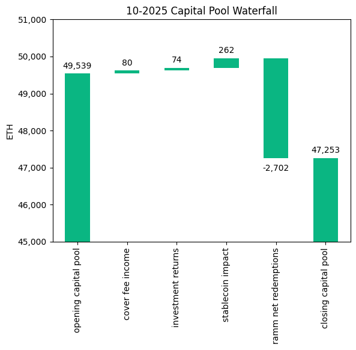
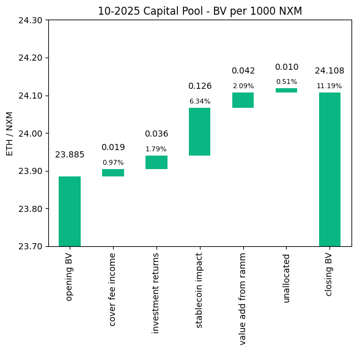
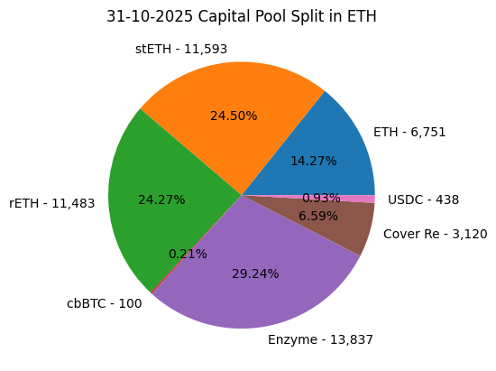
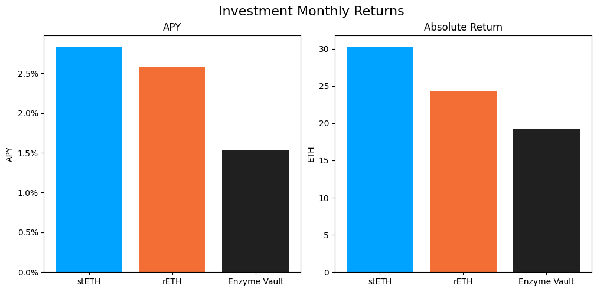

# Investment Committee Newsletter - October 2025

The Investment Committee team presents its October 2025 newsletter, where we share insights surrounding the Capital Pool and Nexus Mutual's investments. The goal is to make key data transparent and easily accessible to everyone.

## State of the Capital Pool

### Monthly Change - ETH value

The Capital Pool decreased by 4.61% in ETH terms this month, from 49.5k to 47.3k ETH. Withdrawals through the RAMM, which totaled 2.7k ETH in redemptions, were the primary factor in this decline. A positive stablecoin FX impact, Cover Fee income, and Investment returns all contributed positively.

The various impacts on the capital pool are summarised in the waterfall chart below.



The cover fee income is net of distribution commissions and excludes covers paid for in NXM. In such a case, the cover fee gets burned and there is no change in the Capital Pool.

### Monthly Change in NXM Book Value

The Capital Pool's ETH/NXM value rose from 0.023885 to 0.024108, representing an 11.7% annualized increase for the month. This growth was primarily driven by the positive stablecoin FX impact, with additional contributions from RAMM activity and investment returns.

The various impacts on the capital pool are summarised in the waterfall chart below.



→ Members can track protocol's revenue on the [Financials Dune Dashboard](https://dune.com/nexus_mutual/capital-pool-and-ownership)
→ Members can track in/outflows on the [Ratcheting AMM Dune Dashboard](https://dune.com/nexus_mutual/ramm)
→ Members can track the cover income on the [Covers Dune Dashboard](https://dune.com/nexus_mutual/covers)

### End of Month Pool Split

The split of the Capital Pool at the end of Oct '25 in ETH terms is as follows.



→ Members can find the updated split at any time on the [Capital Pool and Ownership Dune Dashboard](https://dune.com/nexus_mutual/capital-pool-and-ownership)

## State of the Investments

In the last month, the Mutual earned 73.9 ETH on its investments, overall, as broken down below.

```
stETH Monthly Return: 30.286
stETH Monthly APY: 2.834%

rETH Monthly Return: 24.387
rETH Monthly APY: 2.583%

Enzyme Vault Monthly Return: 19.265
Enzyme Vault Monthly APY: 1.539%
Enzyme Vault includes EtherFi investments

Total ETH Earned: 73.939
Total Monthly APY: 1.848%
Based on average Capital Pool amount over the monthly period

All returns after fees
```



During the month, 2,001 WETH of stETH was sold via CoW Swap on 22 October, in line with the [Divestment Framework](https://forum.nexusmutual.io/t/nmpip-225-divestment-framework/1459). The returns figures above reflect performance net of this divestment.

Active staking investments yielded between 1.5% and 2.8% APY this month, reflecting healthy ETH staking returns. Overall, based on the average Capital Pool value for the month, investments returned 1.8% APY.
