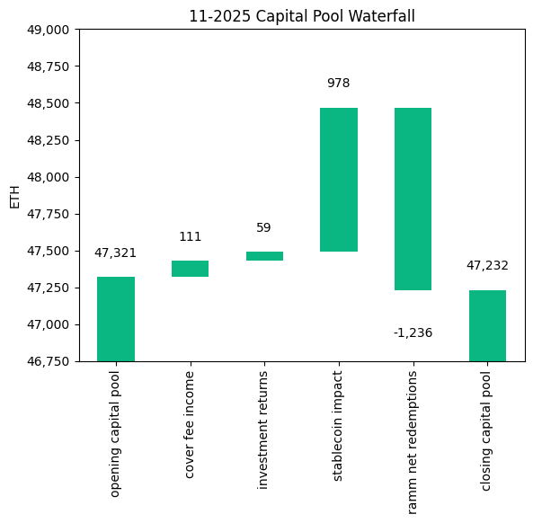
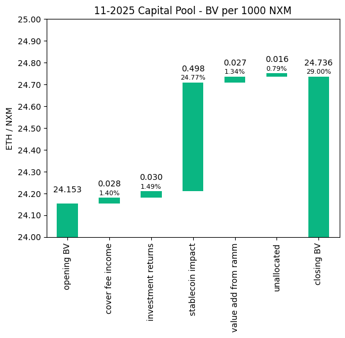
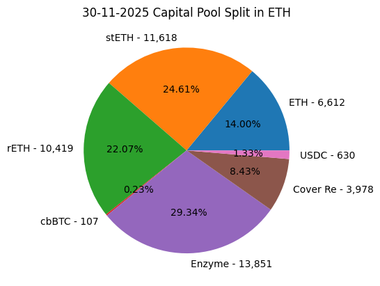
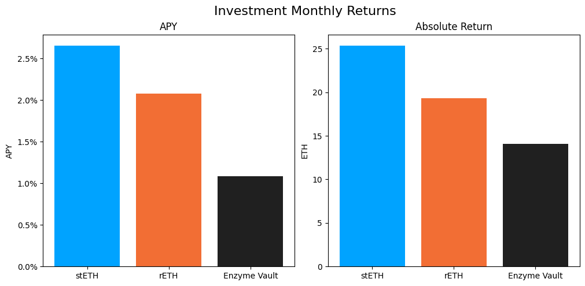

# Investment Committee Newsletter - November 2025

The Investment Committee team presents its November 2025 newsletter, where we share insights surrounding the Capital Pool and Nexus Mutual's investments. The goal is to make key data transparent and easily accessible to everyone.

## State of the Capital Pool

### Monthly Change - ETH value

The Capital Pool decreased by 0.19% in ETH terms this month, from 47.3k to 47.2k ETH. Withdrawals through the RAMM, which totaled 1,236 net redemptions, were the primary factor in this decline. However, a significant positive stablecoin FX impact of 978 ETH partially offset this, while Cover Fees (+111 ETH) and Investment returns (+59 ETH) also contributed positively.

The various impacts on the capital pool are summarised in the waterfall chart below.



The cover fee income is net of distribution commissions and excludes covers paid for in NXM. In such a case, the cover fee gets burned and there is no change in the Capital Pool.

### Monthly Change in NXM Book Value

The Capital Pool's ETH/NXM book value rose from 0.024153 to 0.024736, representing a 33.05% annualised increase for the month. This growth was primarily driven by the significant positive FX impact from stablecoin holdings, with additional contributions from Cover Fees, Investment Returns, and value added through the RAMM.

The various impacts on the capital pool are summarised in the waterfall chart below.



→ Members can track protocol's revenue on the [Financials Dune Dashboard](https://dune.com/nexus_mutual/capital-pool-and-ownership)
→ Members can track in/outflows on the [Ratcheting AMM Dune Dashboard](https://dune.com/nexus_mutual/ramm)
→ Members can track the cover income on the [Covers Dune Dashboard](https://dune.com/nexus_mutual/covers)

### End of Month Pool Split

The split of the Capital Pool at the end of Nov '25 in ETH terms is as follows.



→ Members can find the updated split at any time on the [Capital Pool and Ownership Dune Dashboard](https://dune.com/nexus_mutual/capital-pool-and-ownership)

## State of the Investments

In the last month, the Mutual earned 58.8 ETH on its investments, overall, as broken down below.

```
stETH Monthly Return: 25.337
stETH Monthly APY: 2.654%

rETH Monthly Return: 19.314
rETH Monthly APY: 2.076%

Enzyme Vault Monthly Return: 14.107
Enzyme Vault Monthly APY: 1.082%
Enzyme Vault includes EtherFi investments

Total ETH Earned: 58.758
Total Monthly APY: 1.502%
Based on average Capital Pool amount over the monthly period

All returns after fees
```



During the month, 1,083 WETH of rETH was sold via CoW Swap over 24–26 November (three fills: 151 WETH, 855 WETH, and 78 WETH), in line with the [Divestment Framework](https://forum.nexusmutual.io/t/nmpip-225-divestment-framework/1459). The returns figures above reflect performance net of these divestments.

Active staking investments yielded between 1.1% and 2.7% APY, with stETH delivering the strongest return at 2.654% APY, followed by rETH at 2.076% APY, and the Enzyme Vault (EtherFi investments) at 1.082% APY. Overall, based on the average Capital Pool value for the month, investments returned 1.502% APY.
