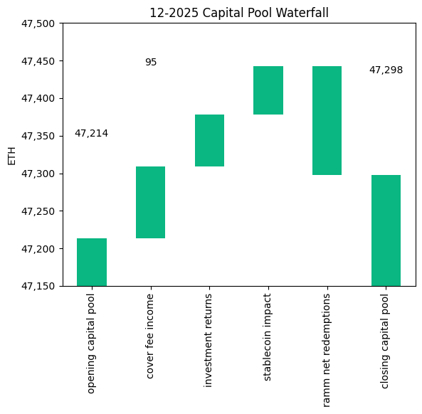
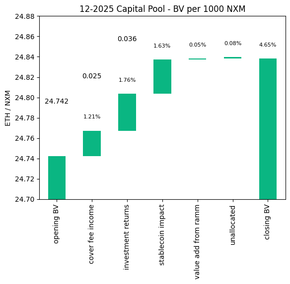
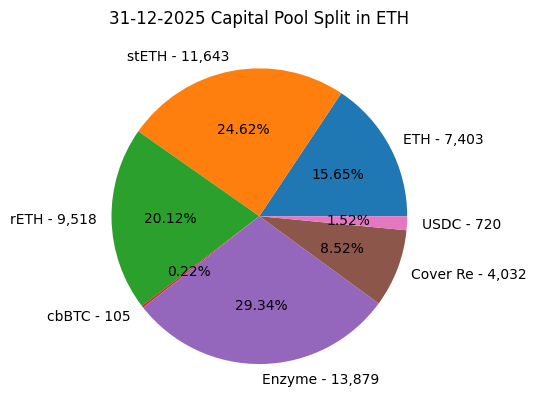
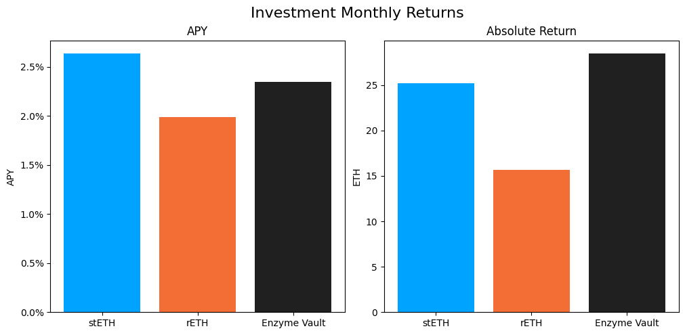

# Investment Committee Newsletter - December 2025

The Investment Committee team presents its December 2025 newsletter, where we share insights surrounding the Capital Pool and Nexus Mutual's investments. The goal is to make key data transparent and easily accessible to everyone.

## State of the Capital Pool

### Monthly Change - ETH value

The Capital Pool increased by 0.18% in ETH terms this month, from 47.2k to 47.3k ETH. Cover fee income (95 ETH), investment returns (69 ETH), and a positive stablecoin FX impact (64 ETH) all contributed to the increase. Notably, RAMM net redemptions were significantly below recent months at just 144 ETH, allowing the three positive drivers to outweigh outflows.

The various impacts on the capital pool are summarised in the waterfall chart below.



The cover fee income is net of distribution commissions and excludes covers paid for in NXM. In such a case, the cover fee gets burned and there is no change in the Capital Pool.

### Monthly Change in NXM Book Value

The Capital Pool's ETH/NXM book value rose from 0.024742 to 0.024838, representing a 4.76% annualised increase for the month. Investment returns (0.036), stablecoin FX impact (0.034), and cover fee income (0.025) all contributed to the gain.

The various impacts on the capital pool are summarised in the waterfall chart below.



→ Members can track protocol's revenue on the [Financials Dune Dashboard](https://dune.com/nexus_mutual/capital-pool-and-ownership)
→ Members can track in/outflows on the [Ratcheting AMM Dune Dashboard](https://dune.com/nexus_mutual/ramm)
→ Members can track the cover income on the [Covers Dune Dashboard](https://dune.com/nexus_mutual/covers)

### End of Month Pool Split

The split of the Capital Pool at the end of Dec '25 in ETH terms is as follows.



→ Members can find the updated split at any time on the [Capital Pool and Ownership Dune Dashboard](https://dune.com/nexus_mutual/capital-pool-and-ownership)

## State of the Investments

In the last month, the Mutual earned 69.3 ETH on its investments, overall, as broken down below.

```
stETH Monthly Return: 25.207
stETH Monthly APY: 2.635%

rETH Monthly Return: 15.662
rETH Monthly APY: 1.990%

Enzyme Vault Monthly Return: 28.48
Enzyme Vault Monthly APY: 2.349%
Enzyme Vault includes EtherFi and Morpho Steakhouse Vault investments

Total ETH Earned: 69.349
Total Monthly APY: 1.775%
Based on average Capital Pool amount over the monthly period

All returns after fees
```



During the month, 917 WETH of rETH was sold via CoW Swap on 1 December, in line with the [Divestment Framework](https://forum.nexusmutual.io/t/nmpip-225-divestment-framework/1459). The returns figures above reflect performance net of this divestment. Idle WETH within the Enzyme vault was also allocated to the Morpho Steakhouse ETH Vault during the month, which should contribute to a slightly higher Enzyme return going forward.

Active investments yielded between 1.99% and 2.64% APY, reflecting steady ETH returns across all positions. The Enzyme vault, which includes EtherFi and Morpho Steakhouse Vault investments, returned 2.35% APY. Overall, based on the average Capital Pool value for the month, investments returned 1.78% APY.
