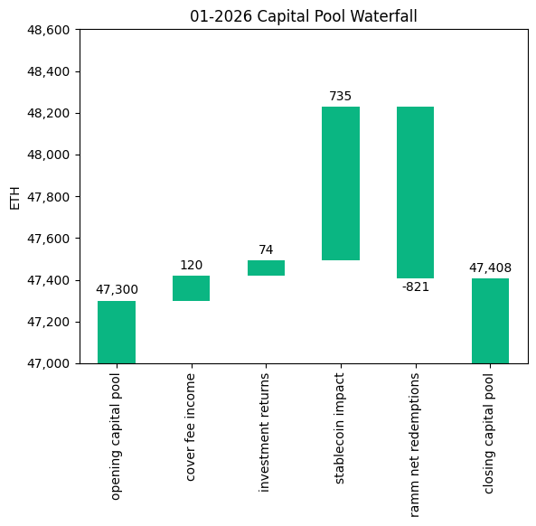
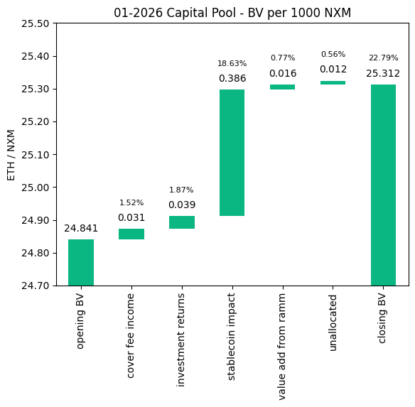
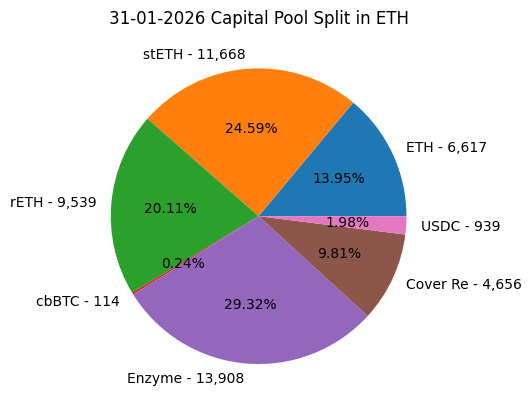
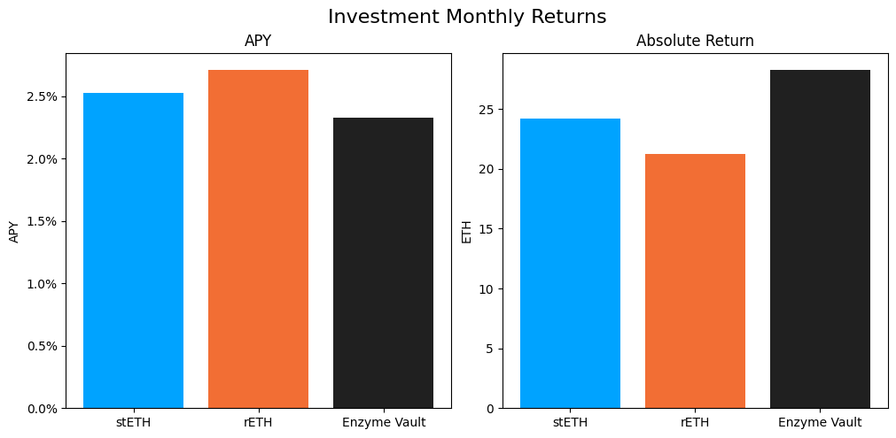

# Investment Committee Newsletter - January 2026

The Investment Committee team presents its January 2026 newsletter, where we share insights surrounding the Capital Pool and Nexus Mutual's investments. The goal is to make key data transparent and easily accessible to everyone.

## State of the Capital Pool

### Monthly Change - ETH value

The Capital Pool increased by 0.23% in ETH terms this month, from 47.3k to 47.4k ETH. A sharp drop in the ETH price from $2,977 to $2,578 created a significant positive FX impact of 735 ETH from stablecoin and Cover Re holdings. This was largely offset by RAMM net redemptions of 821 ETH, with investment returns (74 ETH) and cover fee income (120 ETH) also contributing positively.

The various impacts on the capital pool are summarised in the waterfall chart below.



The cover fee income is net of distribution commissions and excludes covers paid for in NXM. In such a case, the cover fee gets burned and there is no change in the Capital Pool.

### Monthly Change in NXM Book Value

The Capital Pool's ETH/NXM book value rose from 0.024841 to 0.025312, representing a 25.28% annualised increase for the month. The dominant driver was the positive FX impact from the fall in ETH price, which contributed 0.39 ETH per 1000 NXM — 83% of the total 0.47 gain. Investment returns and cover fees contributed a further 0.07, with the RAMM adding 0.02.

The various impacts on the capital pool are summarised in the waterfall chart below.



→ Members can track protocol's revenue on the [Financials Dune Dashboard](https://dune.com/nexus_mutual/capital-pool-and-ownership)
→ Members can track in/outflows on the [Ratcheting AMM Dune Dashboard](https://dune.com/nexus_mutual/ramm)
→ Members can track the cover income on the [Covers Dune Dashboard](https://dune.com/nexus_mutual/covers)

### End of Month Pool Split

The split of the Capital Pool at the end of Jan '26 in ETH terms is as follows.



→ Members can find the updated split at any time on the [Capital Pool and Ownership Dune Dashboard](https://dune.com/nexus_mutual/capital-pool-and-ownership)

## State of the Investments

In the last month, the Mutual earned 73.7 ETH on its investments, overall, as broken down below.

```
stETH Monthly Return: 24.217
stETH Monthly APY: 2.525%

rETH Monthly Return: 21.221
rETH Monthly APY: 2.709%

Enzyme Vault Monthly Return: 28.257
Enzyme Vault Monthly APY: 2.324%
Enzyme Vault includes EtherFi and Morpho Steakhouse Vault investments

Total ETH Earned: 73.695
Total Monthly APY: 1.883%
Based on average Capital Pool amount over the monthly period

All returns after fees
```



Active investments yielded between 2.32% and 2.71% APY, with all positions delivering consistent ETH returns. Overall, based on the average Capital Pool value for the month, investments returned 1.88% APY.
