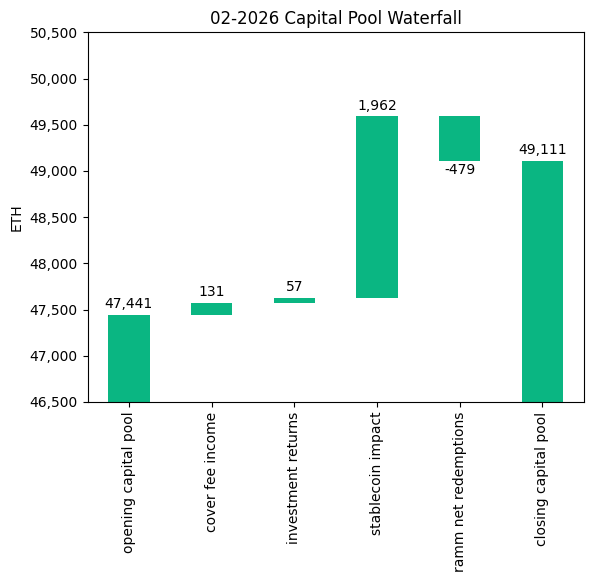
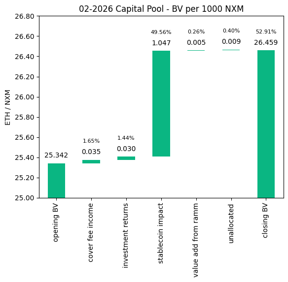
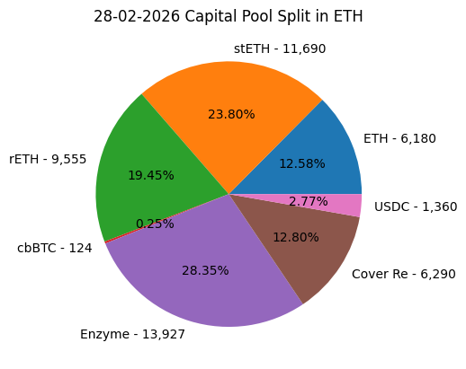
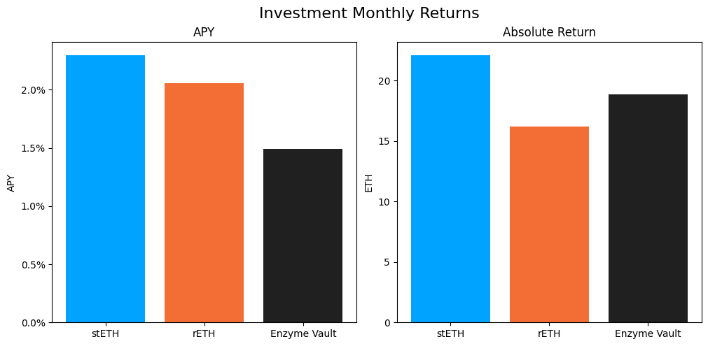

# Investment Committee Newsletter - February 2026

The Investment Committee team presents its February 2026 newsletter, where we share insights surrounding the Capital Pool and Nexus Mutual's investments. The goal is to make key data transparent and easily accessible to everyone.

## State of the Capital Pool

### Monthly Change - ETH value

The Capital Pool increased by 3.52% in ETH terms this month, from 47.4k to 49.1k ETH. The dominant driver was a positive FX impact of +1,962 ETH from stablecoin and Cover Re holdings: ETH/USD fell from $2,578 to $1,909 during February, causing USD-denominated assets to be worth more ETH. Cover fee income (+131 ETH) and investment returns (+57 ETH) also contributed positively. RAMM net redemptions of -479 ETH were the main offsetting factor.

The various impacts on the capital pool are summarised in the waterfall chart below.



The cover fee income is net of distribution commissions and excludes covers paid for in NXM. In such a case, the cover fee gets burned and there is no change in the Capital Pool.

### Monthly Change in NXM Book Value

The Capital Pool's ETH/NXM book value rose from 0.025342 to 0.026459, a 4.41% increase for the month. The stablecoin FX impact was again the dominant driver, accounting for 1.05 of the 1.12 ETH/1000 NXM total gain — approximately 94% of the increase. Cover fee income and investment returns contributed the remainder, while the value add from RAMM was minimal.

The various impacts on the capital pool are summarised in the waterfall chart below.



→ Members can track protocol's revenue on the [Financials Dune Dashboard](https://dune.com/nexus_mutual/capital-pool-and-ownership)
→ Members can track in/outflows on the [Ratcheting AMM Dune Dashboard](https://dune.com/nexus_mutual/ramm)
→ Members can track the cover income on the [Covers Dune Dashboard](https://dune.com/nexus_mutual/covers)

### End of Month Pool Split

The split of the Capital Pool at the end of Feb '26 in ETH terms is as follows.



→ Members can find the updated split at any time on the [Capital Pool and Ownership Dune Dashboard](https://dune.com/nexus_mutual/capital-pool-and-ownership)

## State of the Investments

In the last month, the Mutual earned 57.2 ETH on its investments, overall, as broken down below.

```
stETH Monthly Return: 22.084
stETH Monthly APY: 2.295%

rETH Monthly Return: 16.208
rETH Monthly APY: 2.058%

Enzyme Vault Monthly Return: 18.868
Enzyme Vault Monthly APY: 1.493%
Enzyme Vault includes EtherFi investments

Total ETH Earned: 57.16
Total Monthly APY: 1.430%
Based on average Capital Pool amount over the monthly period

All returns after fees
```



Active investments yielded between 1.5% and 2.3% APY. Overall, based on the average Capital Pool value for the month, investments returned 1.43% APY.
