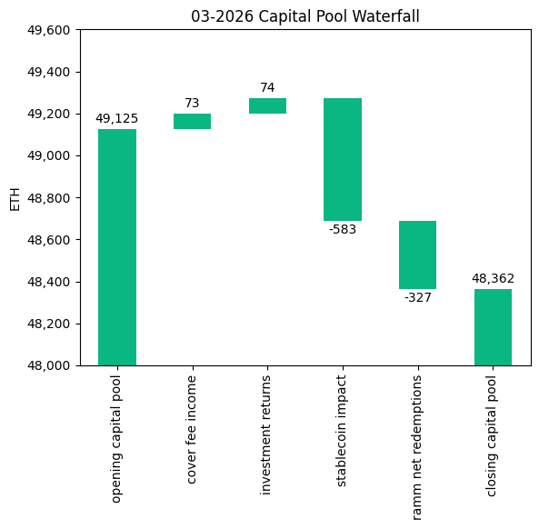
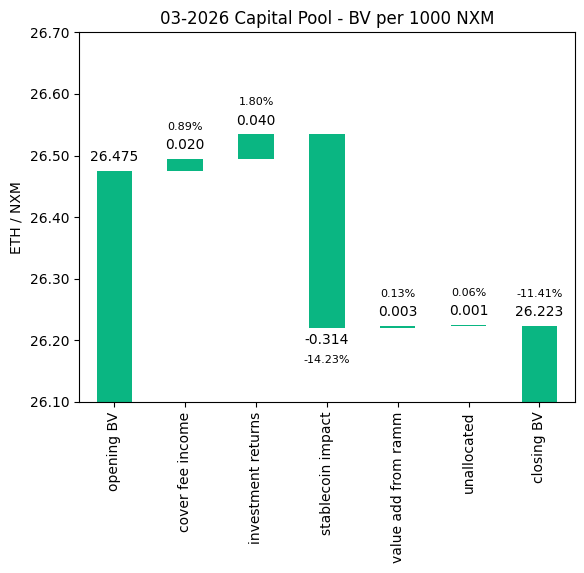
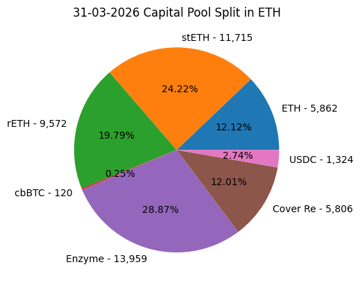
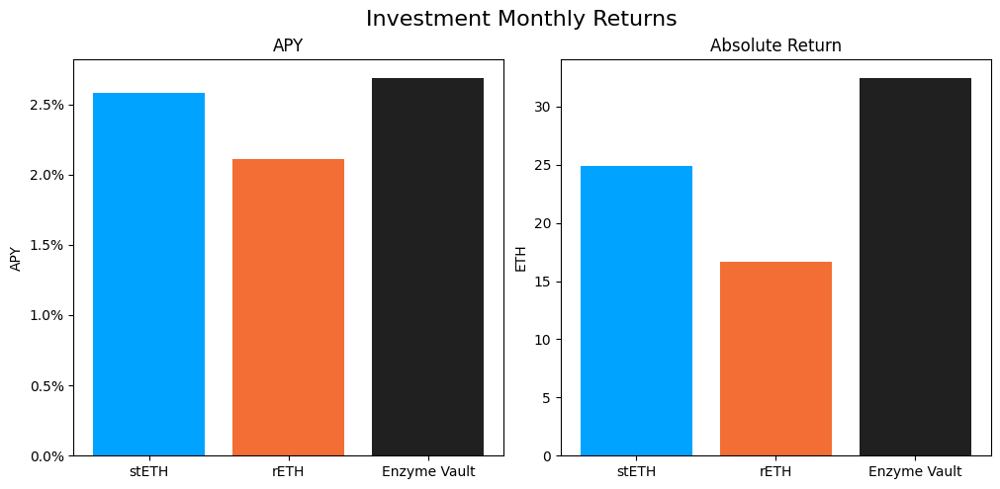

# Investment Committee Newsletter - March 2026

The Investment Committee team presents its March 2026 newsletter, where we share insights surrounding the Capital Pool and Nexus Mutual's investments. The goal is to make key data transparent and easily accessible to everyone.

## State of the Capital Pool

### Monthly Change - ETH value

The Capital Pool decreased by 1.55% in ETH terms this month, from 49.1k to 48.4k ETH. A negative FX impact from stablecoin holdings of 583 ETH was the largest driver of the decline, with RAMM net redemptions accounting for a further 327 ETH outflow. Cover fee income of 73 ETH and investment returns of 74 ETH contributed positively but were not sufficient to offset outflows.

The various impacts on the capital pool are summarised in the waterfall chart below.



The cover fee income is net of distribution commissions and excludes covers paid for in NXM. In such a case, the cover fee gets burned and there is no change in the Capital Pool.

### Monthly Change in NXM Book Value

The Capital Pool's ETH/NXM book value declined from 0.02648 to 0.02622, a 0.95% decrease for the month. The drop was driven primarily by the negative FX impact from stablecoin holdings (-0.31 ETH/1000 NXM), which more than offset positive contributions from investment returns (+0.04) and cover fee income (+0.02). Value added through the RAMM was approximately neutral.

The various impacts on the capital pool are summarised in the waterfall chart below.



→ Members can track protocol's revenue on the [Financials Dune Dashboard](https://dune.com/nexus_mutual/capital-pool-and-ownership)
→ Members can track in/outflows on the [Ratcheting AMM Dune Dashboard](https://dune.com/nexus_mutual/ramm)
→ Members can track the cover income on the [Covers Dune Dashboard](https://dune.com/nexus_mutual/covers)

### End of Month Pool Split

The split of the Capital Pool at the end of Mar '26 in ETH terms is as follows.



→ Members can find the updated split at any time on the [Capital Pool and Ownership Dune Dashboard](https://dune.com/nexus_mutual/capital-pool-and-ownership)

## State of the Investments

In the last month, the Mutual earned 73.9 ETH on its investments, overall, as broken down below.

```
stETH Monthly Return: 24.877
stETH Monthly APY: 2.584%

rETH Monthly Return: 16.628
rETH Monthly APY: 2.108%

Enzyme Vault Monthly Return: 32.442
Enzyme Vault Monthly APY: 2.686%
Enzyme Vault includes EtherFi investments

Total ETH Earned: 73.947
Total Monthly APY: 1.836%
Based on average Capital Pool amount over the monthly period

All returns after fees
```



Active investments yielded between 2.1% and 2.7% APY this month. Overall, based on the average Capital Pool value for the month, investments returned 1.8% APY.
