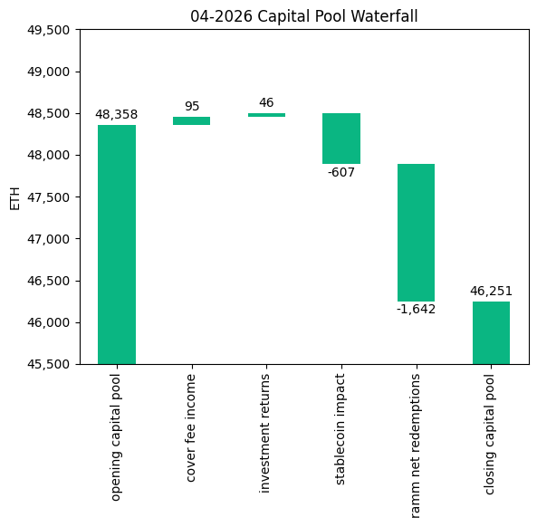
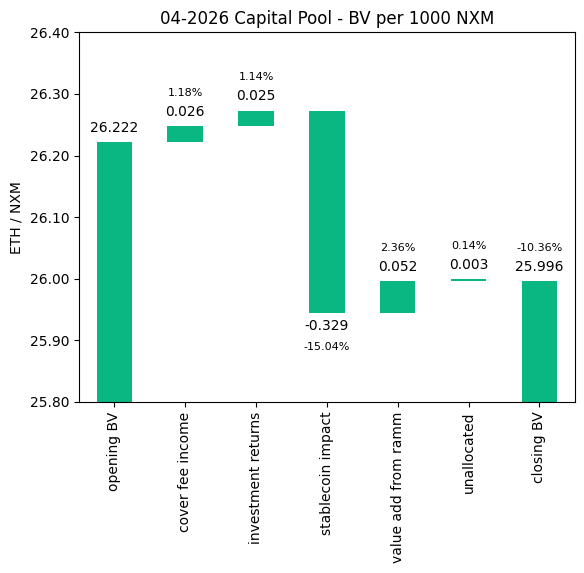
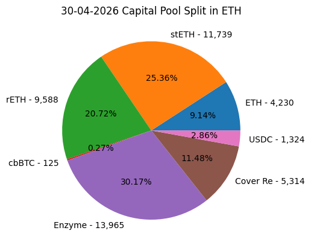
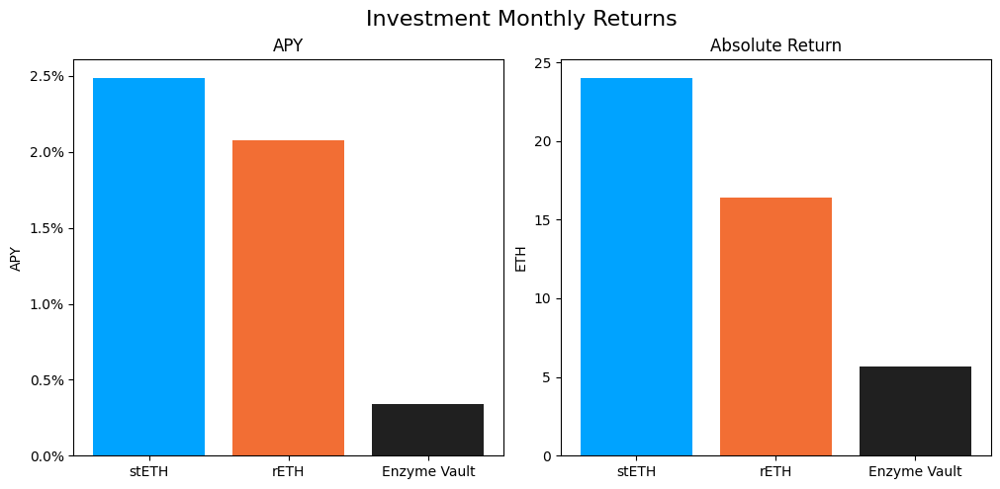

# Investment Committee Newsletter - April 2026

The Investment Committee team presents its April 2026 newsletter, where we share insights surrounding the Capital Pool and Nexus Mutual's investments. The goal is to make key data transparent and easily accessible to everyone.

## State of the Capital Pool

### Monthly Change - ETH value

The Capital Pool decreased by 4.36% in ETH terms this month, from 48.4k to 46.3k ETH. RAMM net redemptions of 1,642 ETH were the largest driver of the decline, with a negative FX impact from stablecoin holdings of 607 ETH adding to the outflows. Cover fee income of 95 ETH and investment returns of 46 ETH contributed positively but were not sufficient to offset outflows.

The various impacts on the capital pool are summarised in the waterfall chart below.



The cover fee income is net of distribution commissions and excludes covers paid for in NXM. In such a case, the cover fee gets burned and there is no change in the Capital Pool.

### Monthly Change in NXM Book Value

The Capital Pool's ETH/NXM book value declined from 0.02622 to 0.02600, a 0.86% decrease for the month. The drop was driven by the negative FX impact from stablecoin holdings (-0.33 ETH/1000 NXM), which outweighed positive contributions from value added through the RAMM (+0.05), cover fee income (+0.03), and investment returns (+0.02).

The various impacts on the capital pool are summarised in the waterfall chart below.



→ Members can track protocol's revenue on the [Financials Dune Dashboard](https://dune.com/nexus_mutual/capital-pool-and-ownership)
→ Members can track in/outflows on the [Ratcheting AMM Dune Dashboard](https://dune.com/nexus_mutual/ramm)
→ Members can track the cover income on the [Covers Dune Dashboard](https://dune.com/nexus_mutual/covers)

### End of Month Pool Split

The split of the Capital Pool at the end of Apr '26 in ETH terms is as follows.



→ Members can find the updated split at any time on the [Capital Pool and Ownership Dune Dashboard](https://dune.com/nexus_mutual/capital-pool-and-ownership)

## State of the Investments

In the last month, the Mutual earned 46.1 ETH on its investments, overall, as broken down below.

```
stETH Monthly Return: 23.991
stETH Monthly APY: 2.485%

rETH Monthly Return: 16.412
rETH Monthly APY: 2.077%

Enzyme Vault Monthly Return: 5.696
Enzyme Vault Monthly APY: 0.342%
Enzyme Vault includes EtherFi investments and the Morpho Steakhouse ETH Vault

Total ETH Earned: 46.099
Total Monthly APY: 1.175%
Based on average Capital Pool amount over the monthly period

All returns after fees
```



Active investments yielded between 0.3% and 2.5% APY this month. The Enzyme vault's mark-to-market value in ETH was held back by widening eETH/ETH and weETH/ETH price discounts following the [April 18 LayerZero / KelpDAO bridge exploit](https://nexusmutual.io/blog/kelpdao-layerzero-incident-report). These discounts, persisting through to end of April, reduced the position's ETH-equivalent value by approximately 22 ETH, leaving the Enzyme Vault at a 5.7 ETH monthly return versus a typical 25-30 ETH. Underlying yield accrued normally, with ether.fi rebasing continuing at around 2.5% APY and the Steakhouse vault unit price appreciating 0.18% over the month (~2.2% APY). Overall, based on the average Capital Pool value for the month, investments returned 1.2% APY.
