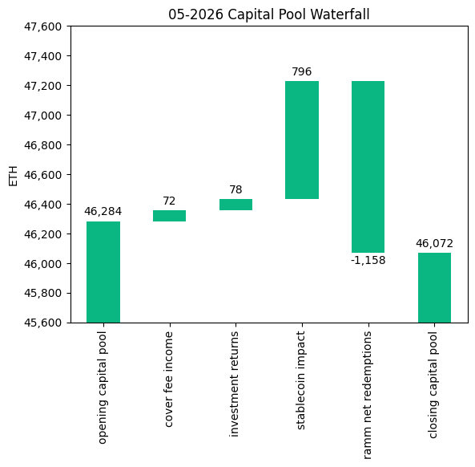
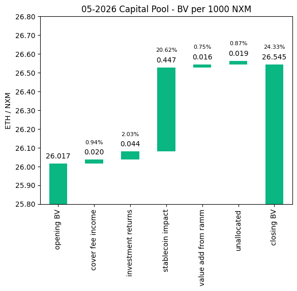
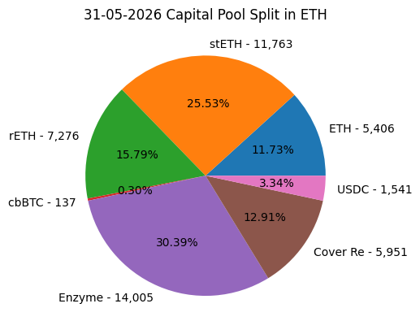
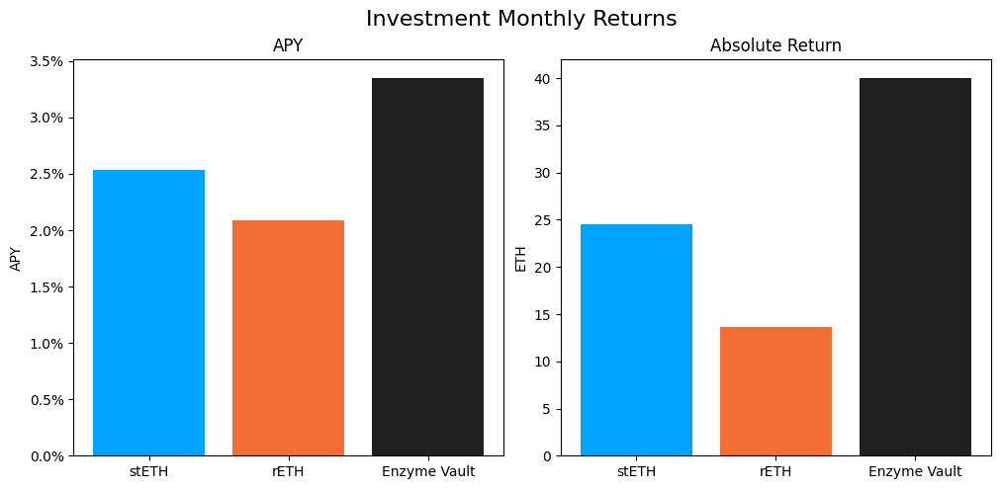

# Investment Committee Newsletter - May 2026

The Investment Committee team presents its May 2026 newsletter, where we share insights surrounding the Capital Pool and Nexus Mutual's investments. The goal is to make key data transparent and easily accessible to everyone.

## State of the Capital Pool

### Monthly Change - ETH value

The Capital Pool decreased by 0.46% in ETH terms this month, from 46.3k to 46.1k ETH. RAMM net redemptions of 1,158 ETH (negative) were the primary driver of the decline. A positive FX impact from stablecoin holdings of 796 ETH, investment returns of 78 ETH, and cover fee income of 72 ETH all contributed positively but were not sufficient to fully offset the redemptions.

The various impacts on the capital pool are summarised in the waterfall chart below.



The cover fee income is net of distribution commissions and excludes covers paid for in NXM. In such a case, the cover fee gets burned and there is no change in the Capital Pool.

### Monthly Change in NXM Book Value

The Capital Pool's ETH/NXM book value rose from 0.02602 to 0.02654, a 2.03% increase for the month. The positive FX impact from stablecoin holdings (+0.45 ETH/1000 NXM) was the dominant driver, accounting for the bulk of the 0.52 ETH/1000 NXM total increase. Investment returns (+0.04), cover fee income (+0.02), value add from the RAMM (+0.02), and an unallocated residual (+0.02) made up the remainder.

The various impacts on the capital pool are summarised in the waterfall chart below.



→ Members can track protocol's revenue on the [Financials Dune Dashboard](https://dune.com/nexus_mutual/capital-pool-and-ownership)
→ Members can track in/outflows on the [Ratcheting AMM Dune Dashboard](https://dune.com/nexus_mutual/ramm)
→ Members can track the cover income on the [Covers Dune Dashboard](https://dune.com/nexus_mutual/covers)

### End of Month Pool Split

The split of the Capital Pool at the end of May '26 in ETH terms is as follows.



→ Members can find the updated split at any time on the [Capital Pool and Ownership Dune Dashboard](https://dune.com/nexus_mutual/capital-pool-and-ownership)

## State of the Investments

In the last month, the Mutual earned 78.2 ETH on its investments, overall, as broken down below.

```
stETH Monthly Return: 24.488
stETH Monthly APY: 2.532%

rETH Monthly Return: 13.671
rETH Monthly APY: 2.086%

Enzyme Vault Monthly Return: 40.012
Enzyme Vault Monthly APY: 3.348%
Enzyme Vault includes EtherFi investments and the Morpho Steakhouse ETH Vault

Total ETH Earned: 78.171
Total Monthly APY: 2.050%
Based on average Capital Pool amount over the monthly period

All returns after fees
```



Active investments yielded between 2.1% and 3.3% APY. Overall, based on the average Capital Pool value for the month, investments returned 2.05% APY.
