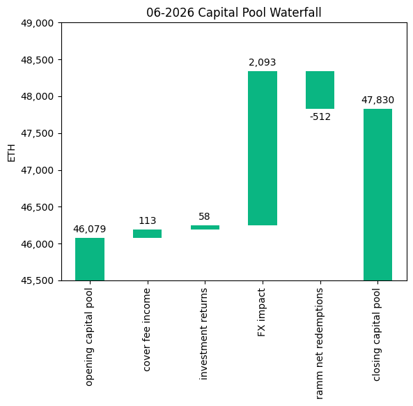
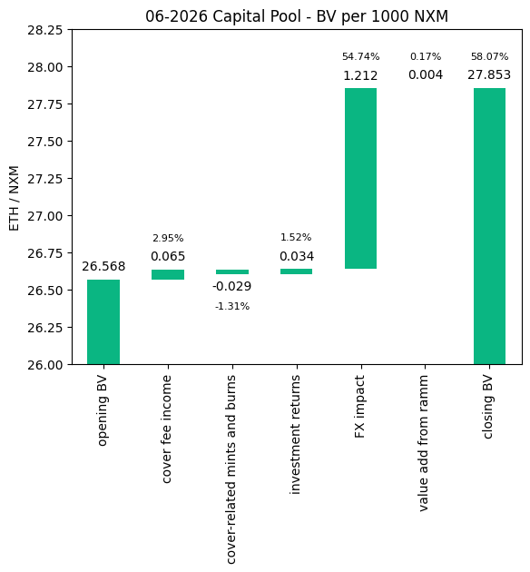
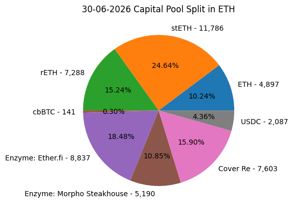
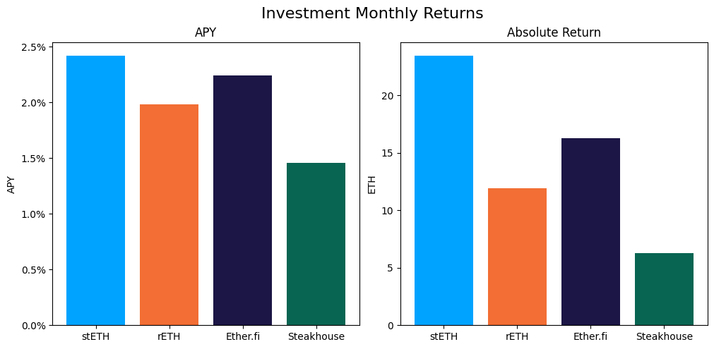

# Investment Committee Newsletter - June 2026

The Investment Committee team presents its June 2026 newsletter, where we share insights surrounding the Capital Pool and Nexus Mutual's investments. The goal is to make key data transparent and easily accessible to everyone.

We're catching up on a backlog of monthly newsletters, covering June 2026 to August 2026. The individual monthly reports are posted as replies to this thread.

From the June report onwards, we report the Enzyme Vault's two constituent parts separately: EtherFi and the Morpho Steakhouse ETH Vault. We have also updated both waterfall charts to more comprehensively and accurately capture changes and ensure the final balance corresponds to the closing Capital Pool value. Cover fee income is now measured from the premiums the Capital Pool receives onchain, including those paid in cbBTC, with each premium valued in ETH on the day it arrives. The book value chart has a new item, cover-related mints and burns, explained below the chart.

## State of the Capital Pool

### Monthly Change - ETH value

The Capital Pool increased by 3.80% in ETH terms this month, from 46.1k to 47.8k ETH. A positive FX impact of 2,093 ETH from the pool's non-ETH holdings (USD-denominated assets and cbBTC) was the primary driver, as ETH fell against the dollar over the month. Cover fee income of 113 ETH and investment returns of 58 ETH also contributed positively. RAMM net redemptions of 512 ETH (negative) were the only outflow.

The various impacts on the capital pool are summarised in the waterfall chart below.



The cover fee income is net of distribution commissions and excludes covers paid for in NXM. In such a case, the cover fee gets burned and there is no change in the Capital Pool.

### Monthly Change in NXM Book Value

The Capital Pool's ETH/NXM book value rose from 0.02657 to 0.02785, a 4.84% increase for the month. The positive FX impact (+1.212 ETH/1000 NXM) accounted for 94% of the 1.286 ETH/1000 NXM total increase. Cover fee income (+0.065), investment returns (+0.034) and value add from the RAMM (+0.004) added to this, while cover-related mints and burns reduced book value by 0.029.

The various impacts on the capital pool are summarised in the waterfall chart below.



Cover-related mints and burns note: This item combines NXM burns and mints from staking rewards, claim burns, cover edits (including "burning" of yet-to-be-streamed staking rewards) and covers paid for with NXM.

→ Members can track protocol's revenue on the [Financials Dune Dashboard](https://dune.com/nexus_mutual/capital-pool-and-ownership)
→ Members can track in/outflows on the [Ratcheting AMM Dune Dashboard](https://dune.com/nexus_mutual/ramm)
→ Members can track the cover income on the [Covers Dune Dashboard](https://dune.com/nexus_mutual/covers)

### End of Month Pool Split

The split of the Capital Pool at the end of Jun '26 in ETH terms is as follows.



→ Members can find the updated split at any time on the [Capital Pool and Ownership Dune Dashboard](https://dune.com/nexus_mutual/capital-pool-and-ownership)

## State of the Investments

In the last month, the Mutual earned 57.9 ETH on its investments, overall, as broken down below.

```
stETH Monthly Return: 23.437
stETH Monthly APY: 2.417%

rETH Monthly Return: 11.918
rETH Monthly APY: 1.984%

Enzyme Vault Monthly Return: 22.523
Enzyme Vault Monthly APY: 1.947%
Enzyme Vault includes EtherFi investments and the Morpho Steakhouse ETH Vault

EtherFi Monthly Return: 16.276
EtherFi Monthly APY: 2.238%
Morpho Steakhouse Monthly Return: 6.246
Morpho Steakhouse Monthly APY: 1.454%

Total ETH Earned: 57.878
Total Monthly APY: 1.489%
Based on average Capital Pool amount over the monthly period

All returns after fees
```



Active investments yielded between 1.5% and 2.4% APY, with the Morpho Steakhouse ETH Vault at the low end and stETH at the high end. Overall, based on the average Capital Pool value for the month, investments returned 1.49% APY.
