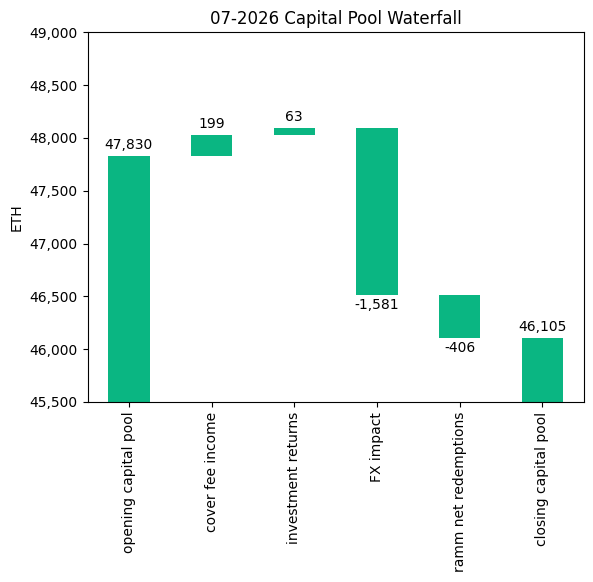
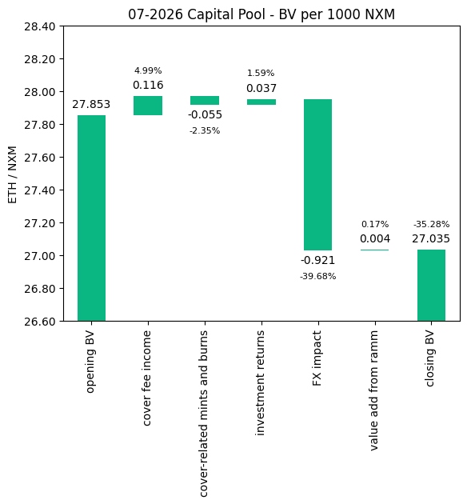
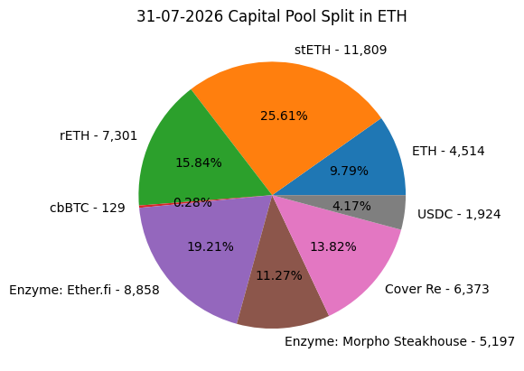
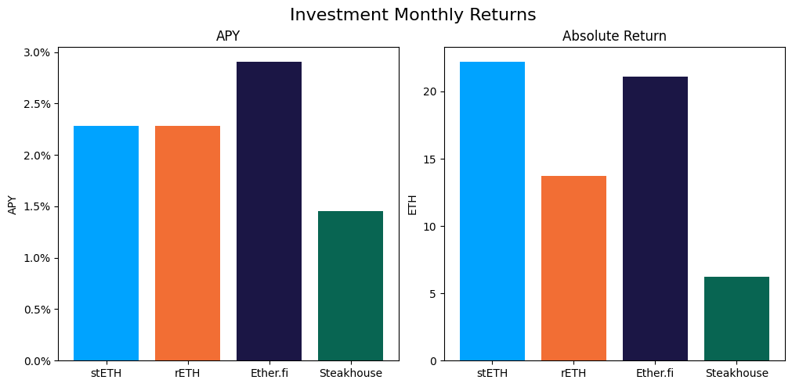

# Investment Committee Newsletter - July 2026

The Investment Committee team presents its July 2026 newsletter, where we share insights surrounding the Capital Pool and Nexus Mutual's investments. The goal is to make key data transparent and easily accessible to everyone.

## State of the Capital Pool

### Monthly Change - ETH value

The Capital Pool decreased by 3.61% in ETH terms this month, from 47.8k to 46.1k ETH. A negative FX impact of 1,581 ETH from the pool's non-ETH holdings (USD-denominated assets and cbBTC) was the primary driver, as ETH rose against the dollar over the month. RAMM net redemptions of 406 ETH (negative) also reduced the pool. Cover fee income of 199 ETH and investment returns of 63 ETH contributed positively.

The various impacts on the capital pool are summarised in the waterfall chart below.



The cover fee income is net of distribution commissions and excludes covers paid for in NXM. In such a case, the cover fee gets burned and there is no change in the Capital Pool.

### Monthly Change in NXM Book Value

The Capital Pool's ETH/NXM book value fell from 0.02785 to 0.02703, a 2.94% decrease for the month. The negative FX impact (-0.921 ETH/1000 NXM) was larger than the total decrease of 0.819 ETH/1000 NXM. Cover fee income (+0.116), investment returns (+0.037) and value add from the RAMM (+0.004) partly offset it, while cover-related mints and burns reduced book value by a further 0.055.

The various impacts on the capital pool are summarised in the waterfall chart below.



Cover-related mints and burns note: This item combines NXM burns and mints from staking rewards, claim burns, cover edits (including "burning" of yet-to-be-streamed staking rewards) and covers paid for with NXM.

→ Members can track protocol's revenue on the [Financials Dune Dashboard](https://dune.com/nexus_mutual/capital-pool-and-ownership)
→ Members can track in/outflows on the [Ratcheting AMM Dune Dashboard](https://dune.com/nexus_mutual/ramm)
→ Members can track the cover income on the [Covers Dune Dashboard](https://dune.com/nexus_mutual/covers)

### End of Month Pool Split

The split of the Capital Pool at the end of Jul '26 in ETH terms is as follows.



→ Members can find the updated split at any time on the [Capital Pool and Ownership Dune Dashboard](https://dune.com/nexus_mutual/capital-pool-and-ownership)

## State of the Investments

In the last month, the Mutual earned 63.3 ETH on its investments, overall, as broken down below.

```
stETH Monthly Return: 22.199
stETH Monthly APY: 2.284%

rETH Monthly Return: 13.721
rETH Monthly APY: 2.283%

Enzyme Vault Monthly Return: 27.358
Enzyme Vault Monthly APY: 2.366%
Enzyme Vault includes EtherFi investments and the Morpho Steakhouse ETH Vault

EtherFi Monthly Return: 21.113
EtherFi Monthly APY: 2.905%
Morpho Steakhouse Monthly Return: 6.245
Morpho Steakhouse Monthly APY: 1.454%

Total ETH Earned: 63.278
Total Monthly APY: 1.629%
Based on average Capital Pool amount over the monthly period

All returns after fees
```



Active investments yielded between 1.5% and 2.9% APY, with the Morpho Steakhouse ETH Vault at the low end and EtherFi at the high end. EtherFi is valued at the weETH market price, so its return includes market price moves as well as staking yield. Overall, based on the average Capital Pool value for the month, investments returned 1.63% APY.
